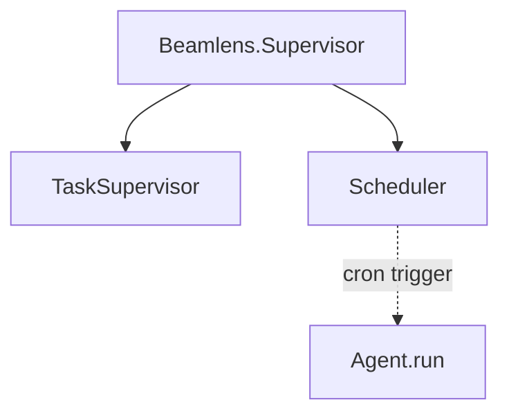
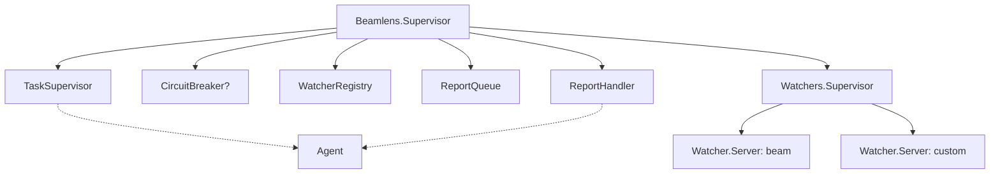
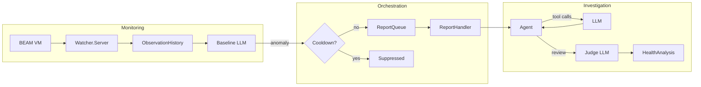
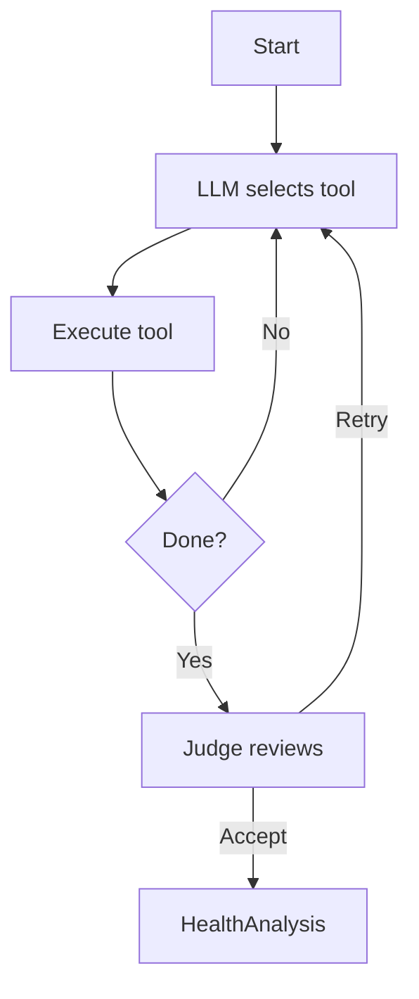

# Architecture

BeamLens is a runtime AI agent that monitors BEAM application health and generates actionable analyses. It supports two operational modes: a simple scheduler mode for periodic health checks, and an orchestrator-workers mode with baseline learning and anomaly detection.

## Operational Modes

### Scheduler Mode (Default)

The default application startup runs a minimal supervisor that executes `Agent.run` on cron schedules:



This mode runs direct health analyses without baseline learning. Configure schedules in your application:

```elixir
config :beamlens,
  schedules: [default: [cron: "*/5 * * * *"]]
```

### Orchestrator-Workers Mode

For continuous monitoring with baseline learning, configure watchers to start the full supervision tree:



Each watcher runs independently. If one crashes, others continue operating. CircuitBreaker is optional.

```elixir
config :beamlens,
  watchers: [{:beam, "*/1 * * * *"}]
```

## Data Flow (Orchestrator-Workers Mode)

Data flows through three stages: monitoring, orchestration, and investigation.



1. **Monitoring**: Watcher servers collect VM metrics on cron schedules, storing observations in a sliding window. The baseline LLM learns normal patterns and detects deviations.
2. **Orchestration**: When anomalies are detected, they pass through a cooldown check to prevent duplicate alerts, then flow through a queue to the handler.
3. **Investigation**: The agent runs a tool-calling loop to gather detailed metrics, then a judge reviews the analysis.

## Alert Cooldown

To prevent alert fatigue, detected anomalies are subject to a per-category cooldown. The baseline LLM specifies the cooldown duration based on context (defaulting to 5 minutes). After reporting an anomaly, subsequent anomalies of the same category within the cooldown period are suppressed. Categories are derived from the anomaly type prefix (e.g., "memory_high" -> memory).

## Agent Loop

The agent uses an LLM to select which metrics to gather, executing tools until it has enough information to produce an analysis.



Available tools include GetOverview, GetSystemInfo, GetMemoryStats, GetProcessStats, GetSchedulerStats, GetAtomStats, GetPersistentTerms, and GetTopProcesses.

## Components

| Component | Purpose |
|-----------|---------|
| Scheduler | Cron-based scheduler for direct Agent.run invocations (default mode) |
| Watcher.Server | GenServer running individual watcher on cron schedule |
| ObservationHistory | Sliding window buffer for baseline observations |
| Baseline.Analyzer | Calls AnalyzeBaseline LLM to learn patterns and detect anomalies |
| Baseline.Context | Tracks LLM notes and timing for baseline learning |
| ReportQueue | Buffer anomaly reports from watchers |
| ReportHandler | Trigger investigation when reports arrive |
| Agent | Run tool-calling loop to gather metrics |
| Judge | Review analysis quality, request retries if needed |
| CircuitBreaker | Protect against LLM rate limits (optional) |
| WatcherRegistry | Registry for looking up watcher processes by name |

## LLM Integration

BeamLens uses [BAML](https://docs.boundaryml.com) for type-safe LLM prompts via the [Puck](https://github.com/bradleygolden/puck) framework. Three BAML functions handle different stages:

- **AnalyzeBaseline**: Observes metrics over time, decides whether to continue watching, report an anomaly, or report healthy (orchestrator-workers mode only)
- **SelectTool**: Main agent loop, chooses which metric-gathering tool to execute next
- **JudgeAnalysis**: Reviews the agent's analysis for quality, may request retries
